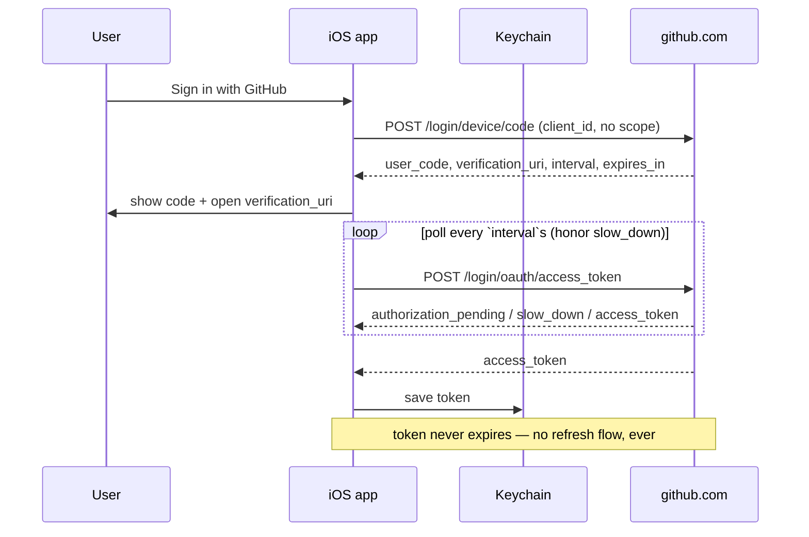

# Auth — GitHub Device Flow

Only the **iOS** app authenticates to GitHub. It runs the GitHub App device
flow natively against `github.com` — no CORS proxy, because a native app has no
browser same-origin restriction to shim around (the trailhead PWA needed
Cloudflare Pages Functions for exactly that; they're gone). The Mac app needs no
GitHub auth at all: it pushes through the user's own git credentials.

> **Keep in sync** with `CairnsKit/Sources/CairnsKit/GitHubAuth.swift`
> (`GitHubAuth`, `DeviceCode`, `CairnsGitHubApp.clientID`) and
> `TokenStore.swift` (`KeychainTokenStore`).

## The flow

## Contract

- **GitHub App, Contents R&W only.** The reused app's sole permission is
  Contents (Read & Write) — enough to commit notes, nothing more. The client ID
  is public and lives in `CairnsGitHubApp.clientID`.
- **Tokens never expire; there is no refresh flow, by decision.** The app's
  "Expire user authorization tokens" toggle is kept **off** — that toggle is the
  operational guardrail. The device-flow token is good forever; Cairns will
  never implement OAuth refresh. If a token dies (revoked, app uninstalled,
  toggle flipped by mistake), the only path back is re-auth through this same
  flow.
- **Token lives in the Keychain, only.** `KeychainTokenStore`
  (`kSecClassGenericPassword`, service `app.cairns.github-token`). Never in
  files, `UserDefaults`, or logs. Keychain storage is the whole reason for the
  native rewrite — no more PWA storage eviction.
- **401 anywhere → re-auth, writes preserved.** A 401 from any read or write
  routes to the sign-in screen; the offline queue halts but keeps its rows, and
  the same account signing back in resumes the drain (see
  [capture-ios.md](./capture-ios.md)). **403 is a rate limit, not an auth
  failure** — never sign the user out on it.
- **The Mac app needs no GitHub auth.** It reads and writes the notes repo
  purely through the user's local clone and their existing git credentials, so
  it never runs the device flow and never holds a token (see
  [capture-macos.md](./capture-macos.md)).
