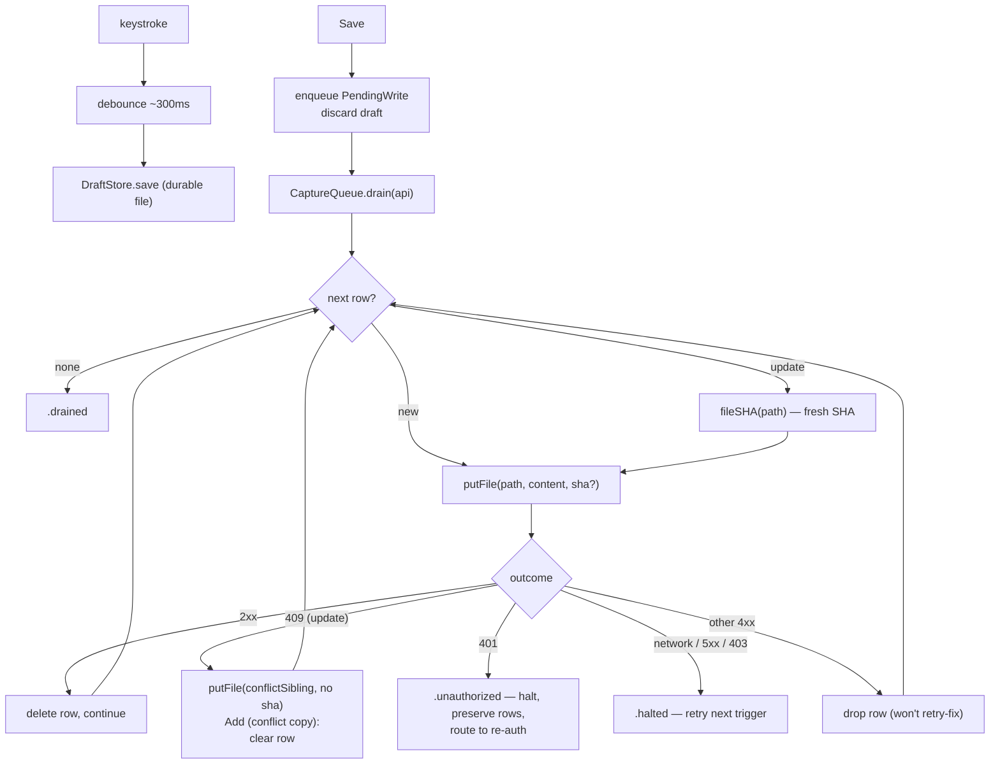

# iOS Capture — Architecture

iOS has no local clone, so it speaks the GitHub REST Contents API through a
durable offline queue. Every save is enqueued first (so a crash or a dropped
connection loses nothing), then drained FIFO — immediately when online, later
when not.

> **Keep in sync** with `CairnsKit/Sources/CairnsKit/CaptureQueue.swift`
> (`DraftStore`, `PendingWrite`, `CaptureQueue`), `GitHubAPI.swift`
> (`GitHubWriting`), and `Filenames.swift`. The doc states the contract; those
> files are the source of truth.

## Boot (optimistic)

A capture app must never gate the editor on a network round-trip. With a token,
a cached login, and a selected repo present, the shell renders the blank editor
immediately — fully offline if need be — and validates the token in the
background. Before any drain, `CaptureQueue.prune(keepingRowsFor:)` drops rows
belonging to a different GitHub account (draining another identity's queue is
the dangerous case). Background validation acts only on a definitive answer: a
401 — or a token that now belongs to a different login — routes to re-auth;
transient failures (offline, 5xx, 403 rate limit) stay quiet.

## Draft → save → drain

Typing debounces (~300ms) into `DraftStore`, a single durable file so a crash
mid-thought recovers. Save transfers ownership: enqueue a `PendingWrite`,
discard the draft, then kick a drain.

## Queue contract

- **Fresh SHA before every update.** Updates refetch the SHA immediately before
  the PUT, so a stale editor never trips a 409. A 409 that survives is a *true*
  concurrent write.
- **409 → conflict sibling.** On an update 409, the content lands at
  `{stem}--local-{YYYY-MM-DD-HHMMSS}{ext}` with message
  `Add (conflict copy): <name>`; the original is never overwritten. A 409 on a
  `new` row (shouldn't happen — new rows have no SHA) halts defensively.
- **401 halts and preserves.** Whole queue is effectively unauthenticated; halt
  with `.unauthorized`, keep every row, route to re-auth. The queue drains again
  after the same account signs back in.
- **403 is a rate limit, NOT auth.** Never sign the user out on 403 — halt like
  any transient error and retry later.
- **network / 5xx → halt** (retry on next trigger); **other 4xx → drop** the row
  (retry can't fix a malformed request).
- **Dedup:** an `update` for a path already queued replaces that row (latest
  content wins); `new` rows never dedupe — each offline capture is distinct.

## Contracts (shared with macOS)

- Filenames: `YYYY-MM-DD-HHMMSS.md`, local time.
- Commit messages: `Add: <name>`, `Update: <name>`,
  `Add (conflict copy): <name>`.

Byte-compatible with the trailhead generation so one notes repo can be written
by both.
