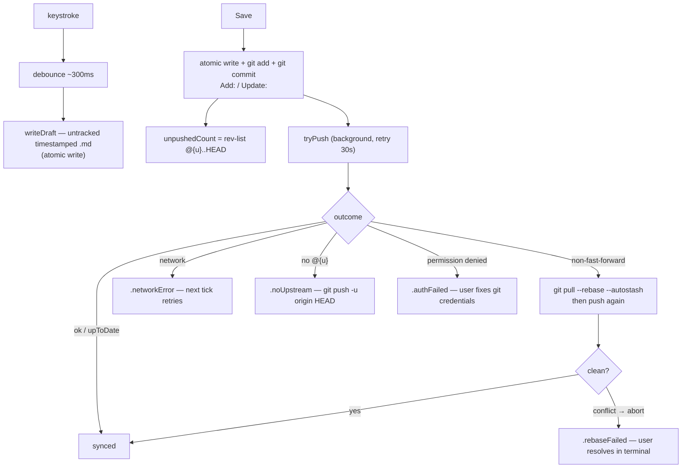

# macOS Capture — Architecture

The Mac app operates on the user's **existing local clone** of the notes repo —
that clone is the source of truth, not a queue Cairns owns. Save is a git
commit; the "queue" is unpushed commits; sync is push + a cadence pull. There is
no REST queue and no injected token here.

> **Keep in sync** with `CairnsKit/Sources/CairnsKit/GitSync.swift`
> (`GitSync`, `PushOutcome`, `PullOutcome`, `SaveResult`) and `Filenames.swift`.
> All git runs shell out to `/usr/bin/git` via `Process`, serialized by the
> actor — one git operation at a time per clone.

## Draft → save → push

A draft is an untracked timestamped `.md` in the capture subfolder, written
atomically (temp file + rename); recovery on launch is the newest untracked
draft. Save is an atomic write + `git add` + `git commit` — durable locally the
instant it returns. Push runs in the background and retries; a non-fast-forward
rejection triggers `git pull --rebase --autostash` then pushes again.

## Contract

- **Local clone is the source of truth.** Cairns never re-clones or resets it;
  other tools (IDE, agents) edit the same tree freely.
- **Queue = unpushed commits.** `rev-list --count @{u}..HEAD`, no separate store.
  Once `git commit` lands, the note is durable; push just catches the remote up.
- **Rebase on rejection.** `git pull --rebase --autostash` reconciles a diverged
  remote. Cairns' adds-only timestamped filenames make conflicts rare; when the
  rebase can't proceed it aborts and surfaces `.rebaseFailed` (the user resolves
  in their own terminal — Cairns does not auto-merge).
- **Cadence pull.** A `pull()` (same rebase-autostash) runs on a user-configured
  interval, default 5 minutes, to pick up notes committed elsewhere.
- **Never inject the token.** Push and pull use the user's **own** git
  credentials (SSH key, credential helper). The GitHub token is never written
  into git config, a remote URL, or a helper — see
  [auth-device-flow.md](./auth-device-flow.md): the Mac app needs no GitHub auth
  at all.

## Contracts (shared with iOS)

- Filenames: `YYYY-MM-DD-HHMMSS.md`, local time.
- Commit messages: `Add: <name>`, `Update: <name>`.

These match the iOS engine and the trailhead generation, so both apps write one
notes repo interchangeably.
